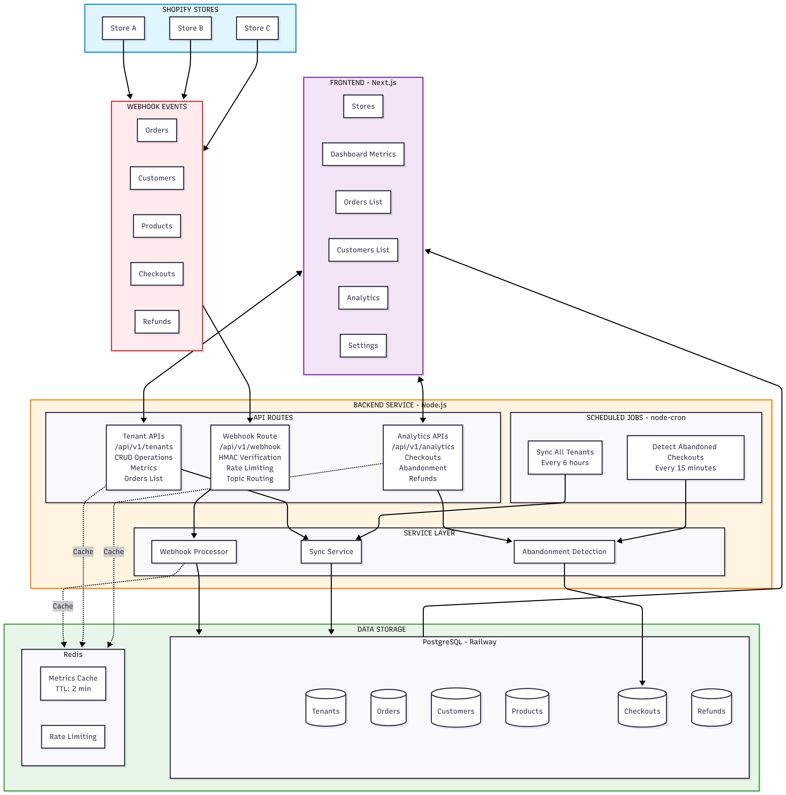

# Xeno FDE Backend - Shopify Data Integration Platform

A multi-tenant backend service that ingests real-time data from Shopify stores via webhooks, provides analytics APIs, and tracks customer behavior including checkout abandonment.

<small>**Live API:** https://xeno-api.navadeepnaidu.com</small>
<small>**Frontend Website:** https://xeno.navadeepnaidu.com</small>
<small>**Frontend Git Repository:** https://github.com/navadeepnaidu7/xeno-fde-frontend</small>

---

## Table of Contents

1. [Assumptions](#1-assumptions)
2. [High-Level Architecture](#2-high-level-architecture)
3. [APIs and Data Models](#3-apis-and-data-models)
4. [Next Steps to Productionize](#4-next-steps-to-productionize)

---

## 1. Assumptions

### Authentication & Authorization

| Assumption | Rationale |
|------------|-----------|
| **No user authentication required** | To simplify evaluation, any user can access the dashboard without login. In production, OAuth 2.0 or JWT-based authentication would be implemented. |
| **Tenant isolation via tenantId** | Each Shopify store is a separate tenant. APIs require `tenantId` parameter to scope data access. |
| **Webhook secrets stored per-tenant** | Each tenant has their own HMAC secret for webhook verification, ensuring payload authenticity. |
| **Access tokens are server-side only** | Shopify Admin API tokens are stored securely and never exposed to frontend clients. |

### Data & Sync

| Assumption | Rationale |
|------------|-----------|
| **Webhooks are the primary data source** | Real-time data ingestion via Shopify webhooks (orders, customers, products). |
| **Historical sync via Admin API** | On-demand and scheduled (every 6 hours) sync for backfilling historical data. |
| **Eventual consistency is acceptable** | Webhook delivery may have delays; scheduled sync ensures data completeness. |
| **Checkout abandonment threshold: 1 hour** | Checkouts without a corresponding order after 60 minutes are marked abandoned. |

### Technical Decisions

| Assumption | Rationale |
|------------|-----------|
| **Single-region deployment** | Deployed on Railway (US region) for simplicity. Multi-region would require distributed caching. |
| **Redis caching is optional** | System works without Redis; caching improves performance but gracefully degrades if unavailable. |
| **PostgreSQL for relational data** | Chosen for ACID compliance, complex queries, and Prisma ORM support. |

---

## 2. High-Level Architecture



 
Refer /prisma/README.md for ER Diagram.

### Component Description

| Component | Technology | Purpose |
|-----------|------------|---------|
| **API Server** | Node.js + Express 5 + TypeScript | REST API endpoints, webhook handling |
| **Database** | PostgreSQL + Prisma ORM | Persistent storage, relational queries |
| **Cache** | Redis (ioredis) | Metrics caching, rate limiting |
| **Scheduler** | node-cron | Periodic sync and abandonment detection |
| **Deployment** | Railway | Cloud hosting with auto-deploy from GitHub |

### Data Flow

1. **Webhook Ingestion:** Shopify sends webhooks → HMAC verified → Data upserted
2. **Scheduled Sync:** Every 6 hours → Shopify Admin API → Full data refresh
3. **Abandonment Detection:** Every 15 minutes → Mark stale checkouts as abandoned
4. **API Requests:** Frontend calls API → Check cache → Query DB → Return response

---

## 3. APIs and Data Models

### API Endpoints

#### Tenant Management

| Method | Endpoint | Description |
|--------|----------|-------------|
| `GET` | `/api/v1/tenants` | List all tenants |
| `POST` | `/api/v1/tenants` | Register new tenant |
| `GET` | `/api/v1/tenants/:id` | Get tenant details |
| `PATCH` | `/api/v1/tenants/:id` | Update tenant |
| `GET` | `/api/v1/tenants/:id/metrics` | Dashboard metrics (cached) |
| `GET` | `/api/v1/tenants/:id/orders` | Paginated orders |
| `GET` | `/api/v1/tenants/:id/customers` | Paginated customers |
| `GET` | `/api/v1/tenants/:id/products` | Paginated products |

#### Sync

| Method | Endpoint | Description |
|--------|----------|-------------|
| `POST` | `/api/v1/sync` | Trigger manual sync |
| `GET` | `/api/v1/sync/status/:tenantId` | Get sync status |

#### Analytics

| Method | Endpoint | Description |
|--------|----------|-------------|
| `GET` | `/api/v1/analytics/checkouts/:tenantId` | Checkout conversion & abandonment stats |
| `GET` | `/api/v1/analytics/checkouts/:tenantId/list` | List checkouts with status filter |
| `GET` | `/api/v1/analytics/refunds/:tenantId` | Refund statistics |
| `GET` | `/api/v1/analytics/refunds/:tenantId/list` | List refunds |
| `POST` | `/api/v1/analytics/detect-abandoned/:tenantId` | Manual abandonment detection |

#### Webhooks

| Method | Endpoint | Description |
|--------|----------|-------------|
| `POST` | `/api/v1/webhook/shopify` | Shopify webhook receiver |

### Data Models

#### Tenant (Multi-tenancy)

```prisma
model Tenant {
  id            String     @id @default(cuid())
  name          String
  shopDomain    String     @unique
  webhookSecret String                    // For HMAC verification
  accessToken   String?                   // Shopify Admin API token (never exposed)
  createdAt     DateTime   @default(now())
  updatedAt     DateTime   @updatedAt
  
  // Relations
  customers     Customer[]
  orders        Order[]
  products      Product[]
  checkouts     Checkout[]
  refunds       Refund[]
}
```

#### Order

```prisma
model Order {
  id          String   @id                 // Shopify order ID
  tenantId    String
  customerId  String?
  total       Float
  currency    String   @default("USD")
  orderNumber Int?
  rawJson     Json                         // Full Shopify payload
  createdAt   DateTime @default(now())
  updatedAt   DateTime @updatedAt
  
  @@index([tenantId, createdAt])
  @@index([tenantId, customerId])
}
```

#### Customer

```prisma
model Customer {
  id          String   @id                 // Shopify customer ID
  tenantId    String
  email       String
  firstName   String?
  lastName    String?
  totalSpent  Float    @default(0)
  ordersCount Int      @default(0)
  rawJson     Json?
  
  @@unique([tenantId, email])
  @@index([tenantId, totalSpent])
}
```

#### Product

```prisma
model Product {
  id          String   @id                 // Shopify product ID
  tenantId    String
  title       String
  vendor      String?
  productType String?
  price       Float    @default(0)
  rawJson     Json?
  
  @@index([tenantId])
}
```

#### Checkout (Abandonment Tracking)

```prisma
model Checkout {
  id                 String         @id @default(cuid())
  tenantId           String
  shopifyCheckoutId  String
  shopifyCartToken   String?
  email              String?
  totalPrice         Float          @default(0)
  currency           String         @default("USD")
  status             CheckoutStatus @default(PENDING)  // PENDING | COMPLETED | ABANDONED
  lineItemsCount     Int            @default(0)
  completedAt        DateTime?
  abandonedAt        DateTime?
  
  @@unique([tenantId, shopifyCheckoutId])
  @@index([tenantId, status])
}
```

#### Refund

```prisma
model Refund {
  id              String   @id @default(cuid())
  tenantId        String
  shopifyRefundId String
  shopifyOrderId  String
  amount          Float    @default(0)
  currency        String   @default("USD")
  reason          String?
  rawJson         Json?
  
  @@unique([tenantId, shopifyRefundId])
  @@index([tenantId, createdAt])
}
```

### Key API Response Examples

#### Dashboard Metrics Response

```json
{
  "customersCount": 7,
  "ordersCount": 11,
  "totalRevenue": 22428.93,
  "topCustomers": [
    {
      "customerId": "8724179353833",
      "email": "customer@example.com",
      "name": "John Doe",
      "totalSpent": 8486.14,
      "ordersCount": 2
    }
  ],
  "ordersByDate": [
    { "date": "2025-12-05", "orders": 2, "revenue": 5823.20 }
  ]
}
```

#### Checkout Analytics Response

```json
{
  "analytics": {
    "totalCheckouts": 100,
    "completedCheckouts": 72,
    "abandonedCheckouts": 20,
    "pendingCheckouts": 8,
    "conversionRate": 72.0,
    "abandonmentRate": 20.0,
    "abandonedValue": 4582.50,
    "completedValue": 22428.93
  }
}
```

---

## 4. Next Steps to Productionize

These are the things I would focus on next to make this production ready:

##### Security
- **Authentication:** Implement OAuth 2.0 / JWT authentication for all API endpoints
- **API Keys:** Issue tenant-specific API keys for programmatic access
- **Role-Based Access Control:** Admin, editor, and read-only roles per tenant

##### Scalability
- **Database Replicas:** Read replicas for analytics queries to reduce load on primary

##### Features
- **Export to Sheets:** Download reports as CSV/Excel for external analysis

##### DevOps
- **CI/CD Pipeline:** GitHub Actions with staging/production environments for team collaboration
- **Database Migrations:** Automated Prisma migrations in CI pipeline

---

## Setting up the project locally

```bash
# Clone and install
git clone https://github.com/navadeepnaidu7/xeno-fde-backend.git
cd xeno-fde-backend
npm install

# Environment setup
cp .env.example .env
# Edit .env with your DATABASE_URL and REDIS_URL

# Database setup
npx prisma migrate dev

# Run development server
npm run dev
```

## Tech Stack

- **Runtime:** Node.js 18+
- **Framework:** Express 5
- **Language:** TypeScript
- **Database:** PostgreSQL + Prisma ORM
- **Cache:** Redis
- **Scheduler:** node-cron
- **Deployment:** Railway


